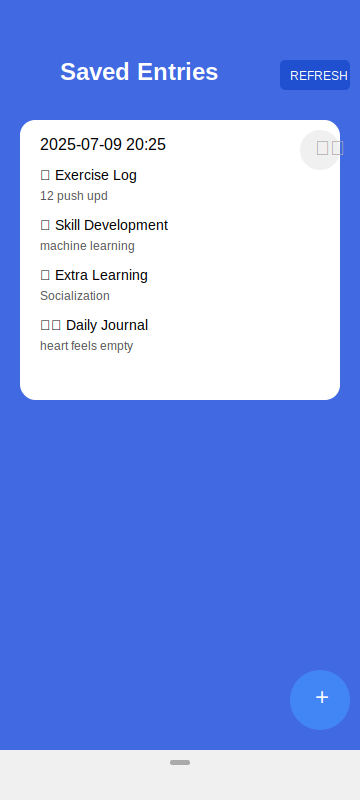

# DailyRays - Personal Progress Tracker

## Overview
DailyRays is an Android application designed to help users track their daily activities, skills development, learning progress, and journal entries. The app provides a simple and intuitive interface for recording and reviewing personal growth across multiple dimensions.

## Features

- **Daily Entry Logging**: Record your daily activities in four key areas:
  - Exercise log (physical activities)
  - Skill development (technical or soft skills practice)
  - Extra learning (additional educational activities)
  - Journal entries (personal reflections)

- **Entry Management**: View, add, and delete entries with ease

- **Chronological Organization**: Entries are organized by date and time for easy tracking of progress

- **Simple Interface**: Clean, intuitive UI designed for quick daily logging

## Technical Details

### Architecture
- Built with Kotlin for Android
- Uses Room Database for local data persistence
- Implements MVVM architecture pattern
- Utilizes Jetpack Compose and View Binding for UI
- Built entirely using vibe coding methodology

### Dependencies
- AndroidX Core and Lifecycle components
- Room Database for data storage
- Material Design 3 components
- Kotlin Coroutines for asynchronous operations

### Requirements
- Android 7.0 (API level 24) or higher
- Targeting Android 14 (API level 34)

## Getting Started

### For Users
1. Install the application on your Android device
2. Open the app to view the entries list
3. Use the floating action button to add a new entry
4. Fill in the details for your daily activities
5. Save the entry to keep track of your progress
6. Review past entries by scrolling through the list

### For Developers
1. Clone the repository
2. Open the project in Android Studio
3. Sync Gradle files
4. Build and run the application

## Project Structure

- `app/src/main/java/com/shahid/premogear/`
  - `MainActivity.kt`: Initial activity (currently minimal)
  - `ExplorerActivity.kt`: Main activity for viewing and managing entries
  - `EntryAdapter.kt`: RecyclerView adapter for displaying entries
  - `data/`
    - `Entry.kt`: Data class representing a daily entry
    - `EntryDao.kt`: Data Access Object for Room Database operations
    - `AppDatabase.kt`: Room Database configuration

## Development Methodology

This application was built entirely using **vibe coding** - a development approach that emphasizes intuitive, flow-state programming where developers code based on creative inspiration and positive energy rather than rigid specifications. This methodology encourages innovation and creates a more enjoyable development experience while maintaining code quality.

## Current UI

This is the UI I'll make more better in future. It was just a first attempt at creating the interface for tracking daily activities. The current interface shows:

- A clean blue header with app title and refresh button
- Entry cards with date/time stamps
- Four tracking categories with emoji indicators:
  - 💪 Exercise Log
  - 🧠 Skill Development
  - 📚 Extra Learning
  - ✍️ Daily Journal
- Floating action button (+) for adding new entries
- Simple delete functionality for managing entries

## Future Enhancements

- Data visualization for progress tracking
- Reminder notifications for daily entries
- Cloud synchronization for data backup
- Categories and tags for better organization
- Export functionality for entries

## Contact

For any queries or suggestions, please contact:
- Name: Mohammed Shahid S
- Email: shahidsmohammed47@gmail.com
